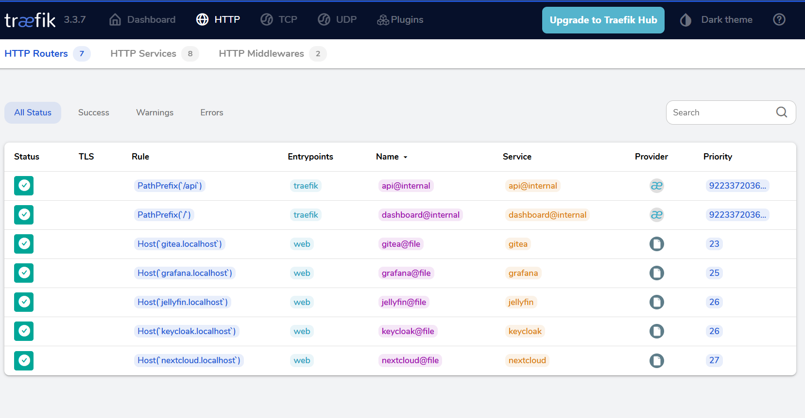
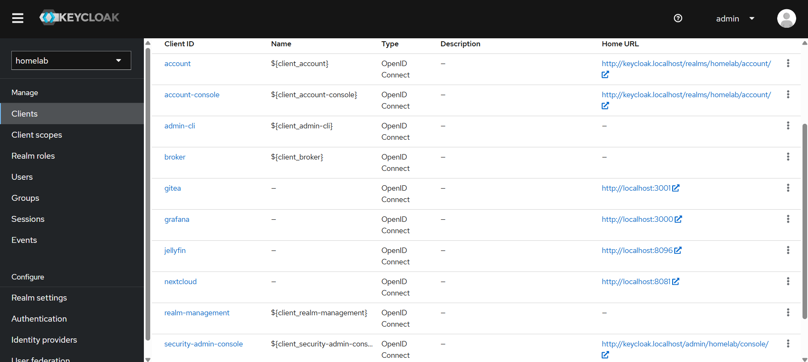
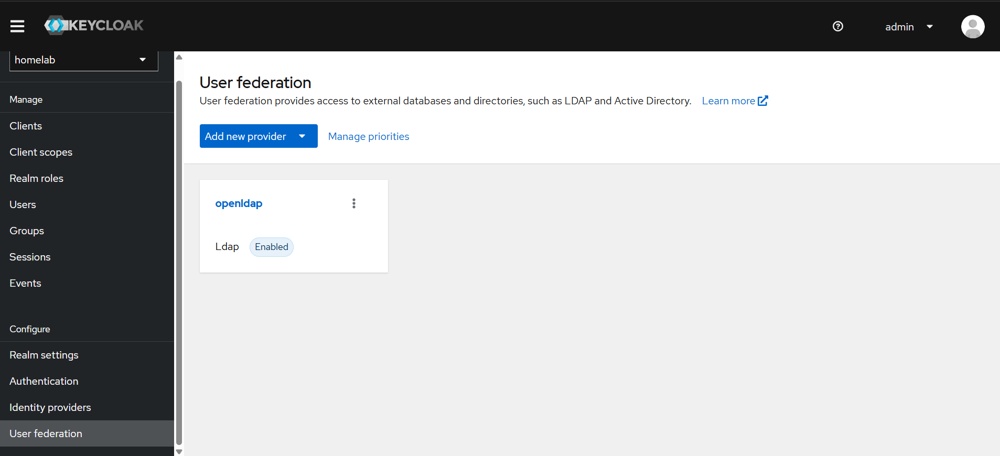
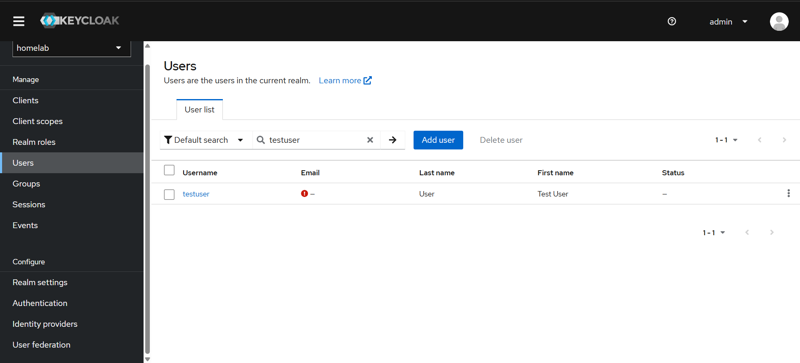

# homelab-sso

A self-hosted homelab platform with unified Single Sign-On (SSO) across multiple services. Users authenticate once through Keycloak, which federates against OpenLDAP as its user store. Each service integrates with Keycloak via OIDC - no service ever handles a password directly.

Built as a portfolio project demonstrating IAM, SSO, LDAP directory services, OAuth2/OIDC, reverse proxying, and containerisation.

## Architecture

Browser → Traefik (reverse proxy)
↓
┌───────────────────────────────┐
│  Grafana  Gitea  Nextcloud  Jellyfin
└───────────┬───────────────────┘
↓
Keycloak (OIDC/OAuth2)
↓
OpenLDAP (users & groups)

## Stack

| Component | Role | URL |
|-----------|------|-----|
| OpenLDAP | User and group directory | — |
| Keycloak | Identity provider (SSO via OIDC) | `keycloak.localhost` |
| Grafana | Monitoring dashboards | `grafana.localhost` |
| Gitea | Self-hosted Git | `gitea.localhost` |
| Nextcloud | File storage | `nextcloud.localhost` |
| Jellyfin | Media server | `jellyfin.localhost` |
| Traefik | Reverse proxy | `localhost:8888` (dashboard) |

## Screenshots

### Traefik - all services routed


### Keycloak - OIDC clients registered


### Keycloak - OpenLDAP federation


### Keycloak - user synced from OpenLDAP


## How it works

1. A user visits any service (such as `grafana.localhost`)
2. Traefik routes the request to the correct container
3. The service redirects to Keycloak for authentication
4. Keycloak authenticates the user against OpenLDAP
5. Keycloak issues a JWT token and redirects back to the service
6. The service grants access and the user never enters a password directly into the service

## Running locally

### Prerequisites
- Docker Desktop
- Git

### Setup

```bash
git clone https://github.com/maaroofs/homelab-sso.git
cd homelab-sso
```

Copy all `.env.example` files to `.env` in each service folder and fill in your passwords.

Start all services:

```bash
docker network create homelab

docker compose -f services/openldap/docker-compose.yml --env-file services/openldap/.env up -d
docker compose -f services/keycloak/docker-compose.yml --env-file services/keycloak/.env up -d
docker compose -f services/grafana/docker-compose.yml --env-file services/grafana/.env up -d
docker compose -f services/gitea/docker-compose.yml --env-file services/gitea/.env up -d
docker compose -f services/nextcloud/docker-compose.yml --env-file services/nextcloud/.env up -d
docker compose -f services/jellyfin/docker-compose.yml --env-file services/jellyfin/.env up -d
docker compose -f services/traefik/docker-compose.yml up -d

docker network connect homelab openldap
```

Add these to your hosts file:

127.0.0.1 grafana.localhost
127.0.0.1 gitea.localhost
127.0.0.1 keycloak.localhost
127.0.0.1 nextcloud.localhost
127.0.0.1 jellyfin.localhost

## License

MIT

